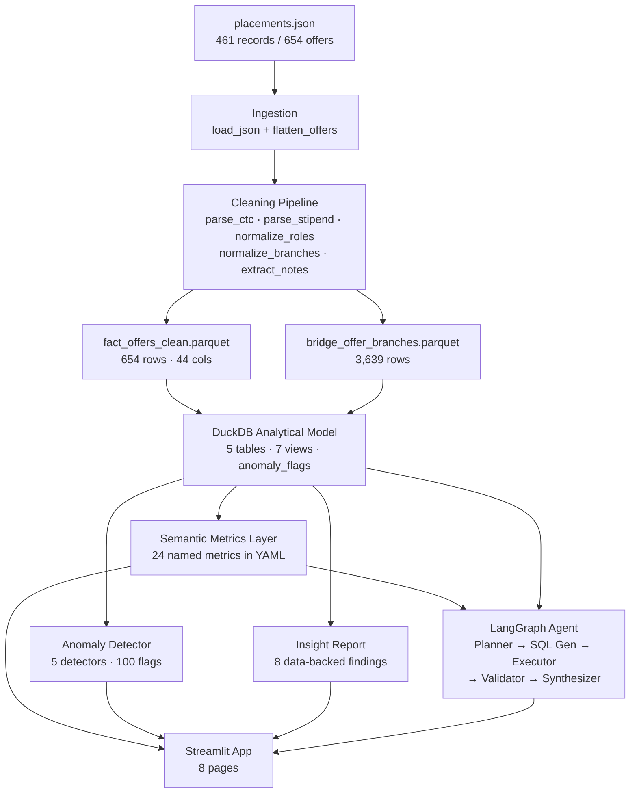

# HirePrism

An end-to-end placement analytics platform built over 654 real campus placement offers from 461 companies. Parses messy, denormalized JSON into a queryable analytical model, surfaces 8 data-backed insights, and exposes a multi-step agentic NL query layer.

---

## Architecture



---

## Key Numbers

| Metric | Value |
|---|---|
| Raw records | 461 parent records → 654 offers |
| Companies | 386 unique |
| Role variants | 118 raw → 11 job families |
| Branch variants | 21 raw codes → 6 groups |
| Overall data quality score | 0.858 / 1.0 |
| CTC parseability | 82.7% |
| Anomaly flags | 100 across 97 offers |
| Named metrics | 24 across 4 categories |
| Tests | 305 passing · 93% coverage |

---

## Top Findings

1. **CTC drops 74% across the placement season** — peak offers arrive in early windows; late-season packages are significantly lower.
2. **PPO roles pay 2.38× more than standard FTE** — Pre-Placement Offers command a steep premium.
3. **Company size and CTC are uncorrelated (r ≈ 0)** — recruiting more students does not predict higher pay.
4. **Civil branches have the best FTE-to-intern ratio** — 5.2× better than Bio branches.
5. **28.6% of offers require no CGPA** — and 27.3% of those are high-package (≥10 LPA).
6. **Software Engineering has the widest CTC range** — 3.6 to 123 LPA within a single job family.
7. **Meesho averages 46.83 LPA for intern-to-FTE roles** — 3.7× the sector average for that offer type.
8. **Academic roles waive CGPA 2.5× more often than Software Engineering**.

Full report: [`data/insights/insight_report.md`](data/insights/insight_report.md)

---

## How to Run

```bash
# 1. Install dependencies
pip install -e ".[dev]"

# 2. Run the full pipeline (ingestion → cleaning → DuckDB → insights)
make pipeline

# 3. Launch the Streamlit app
make app
```

Set `ANTHROPIC_API_KEY` in `.env` (copy from `.env.example`) to enable the NL query agent.

---

## Tech Stack

| Layer | Tool | Why |
|---|---|---|
| Language | Python 3.11+ | Best ecosystem for analytical work |
| Data manipulation | Pandas | Standard, interview-explainable |
| Analytical engine | DuckDB | SQL-native, file-based, fast for 18k-class datasets |
| Storage format | Parquet | Typed, compressed, faster than CSV/JSON |
| App framework | Streamlit | Fastest path to a polished data app |
| Agent framework | LangGraph | Explicit stateful nodes — explainable, not a black box |
| LLM | Claude (Anthropic SDK) | Better structured SQL generation than GPT-3.5-class |
| Metrics layer | YAML + Jinja2 | Lightweight semantic layer — metrics defined once, reused everywhere |
| Anomaly detection | scipy.stats / IQR | Explainable methods; z-score and IQR hold up in interviews |
| Testing | pytest | Standard, 93% coverage |

---

## Project Structure

```
src/
  ingestion/       load + flatten raw JSON
  cleaning/        CTC · stipend · role · branch · note parsers
  quality/         automated quality scoring system with history tracking
  modeling/        DuckDB table + view builder
  metrics/         YAML metric registry + executor
  anomaly/         statistical anomaly detectors + explainer
  insights/        8 insight generators + Jinja2 templates
  agent/           LangGraph multi-step NL query agent
  app/             Streamlit application (main.py + 7 pages)

metrics/definitions/   24 named metrics across 4 YAML files
data/
  raw/             placements.json
  processed/       Parquet files + DuckDB database
  quality/         quality_report.json + history
  insights/        insight_report.md + .json
tests/             12 test files · 305 tests
docs/              data_dictionary · metrics_catalog · assumptions · interview_prep
```

---

## App Pages

| Page | What it shows |
|---|---|
| Overview | KPI cards, quality scorecard, top 3 insight cards |
| Compensation | CTC histogram, FTE vs intern split, stipend distribution, CTC trend |
| Roles | Job family distribution, avg CTC by role, CTC variance, no-CGPA rates |
| Branches | Branch opportunity counts, FTE/intern split, avg CTC per branch |
| Companies | Search + filter, top companies by CTC and volume, single-company drilldown |
| Insights | 8 insight cards with confidence filter and full markdown report |
| Data Quality | Quality scorecard, history trend chart, anomaly summary and flagged records |
| Query Console | 24 pre-defined metrics + NL query box with agent reasoning trace |
